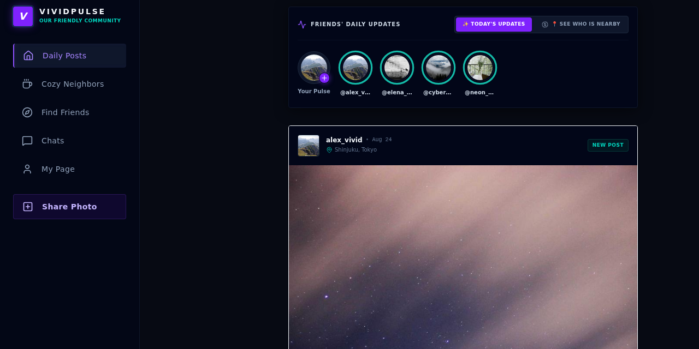
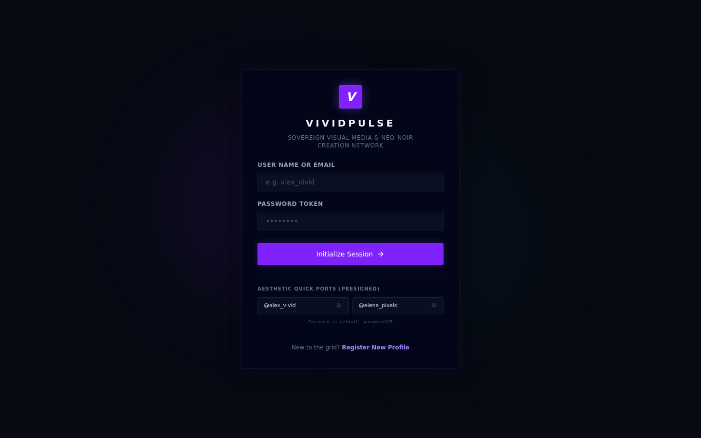
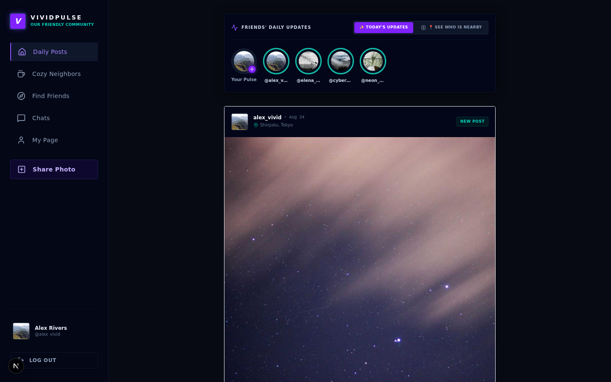
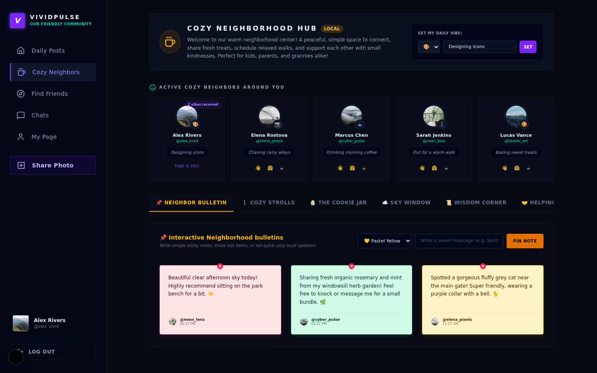
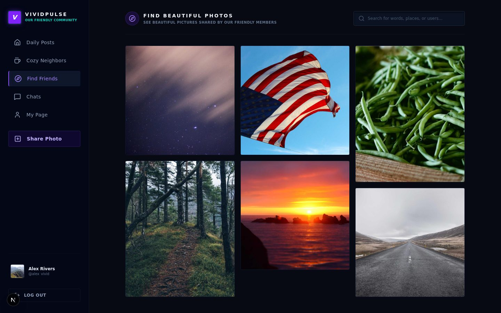
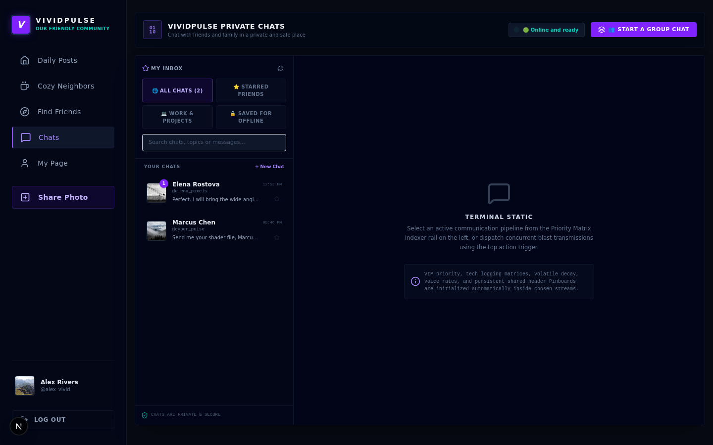

# VividPulse

Neo-noir visual social network. A seeded photo feed, 24-hour stories, DMs, and a cozy neighbors board — built with Next.js 15.

[](https://vividpulse-social.vercel.app)
[](https://github.com/devtechedge/vivid-pulse/actions/workflows/ci.yml)
[](https://nextjs.org/)
[](https://www.typescriptlang.org/)
[](https://tailwindcss.com/)
[](LICENSE)

---

## Live Demo

**https://vividpulse-social.vercel.app**

Do **not** use https://vividpulse.vercel.app — that hostname is a different AI-automation product.

> **Status:** The public site is a **demo**. Auth is a signed `vp_session` cookie (not JWT / NextAuth). Posts, stories, and DMs live in **process memory** and reset on cold start. Seeded login: `alex_vivid` / `password123` (or the one-click ports on the login screen).

This is the **only** public repo for the project.

---

## Screenshots

<p align="center">
  
</p>

| Login | Feed |
|-------|------|
|  |  |

| Neighbors | Discover |
|-----------|----------|
|  |  |



---

## Features

- Seeded creator network with one-click demo login
- Photo feed with carousels, likes, bookmarks, and threaded comments
- 24-hour stories tray and viewer
- Discover search over captions and locations
- Direct messages with polling
- Cozy Neighbors hub — vibes, bulletin notes, strolls, treats
- Session cookie is httpOnly + `SameSite=lax` (`secure` in production)

---

## Tech Stack

| Layer | Technology |
|-------|------------|
| App | Next.js 15 (App Router), React 19, TypeScript |
| UI | Tailwind 4, Lucide, Motion |
| Data | In-memory store (`lib/db.ts`). SQL shape in `docs/schema.sql` |
| Auth | SHA-256 password hash + signed session cookie |
| Media | Mock `/api/upload` (data URLs). Feed images from picsum.photos |
| Hosting | Vercel |
| CI | GitHub Actions — Vitest, `tsc`, Playwright |

---

## Quick Start

```bash
git clone https://github.com/devtechedge/vivid-pulse.git
cd vivid-pulse
npm install
npm run dev
```

Open **http://localhost:3000** and sign in as `alex_vivid` / `password123`. No environment variables required.

```bash
npm test
npm run typecheck
npx playwright install chromium
npm run test:e2e
```

---

## Security

Portfolio demo: public password, committed fallback session secret, in-memory store. Details: **[SECURITY.md](SECURITY.md)**.

---

## License

MIT. See [LICENSE](LICENSE).
